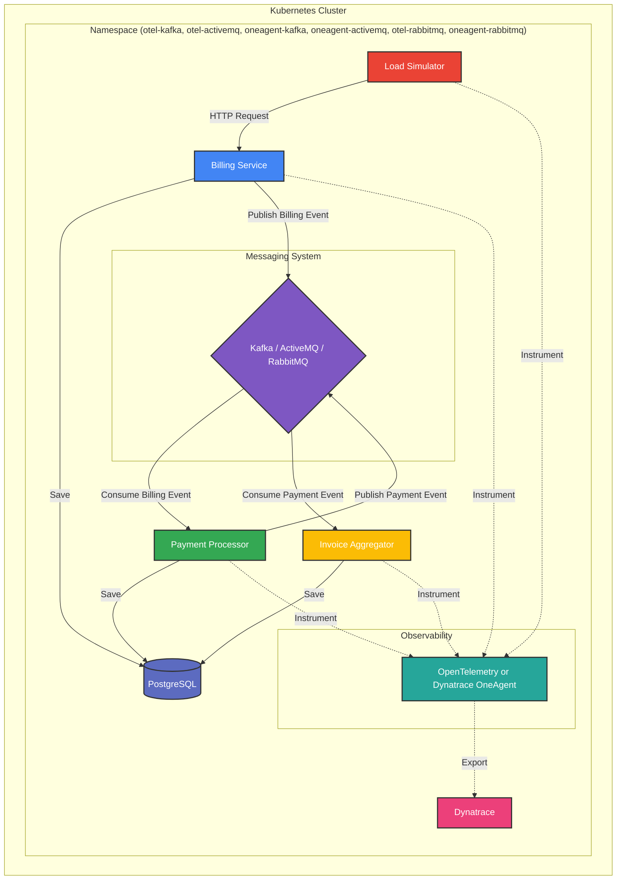
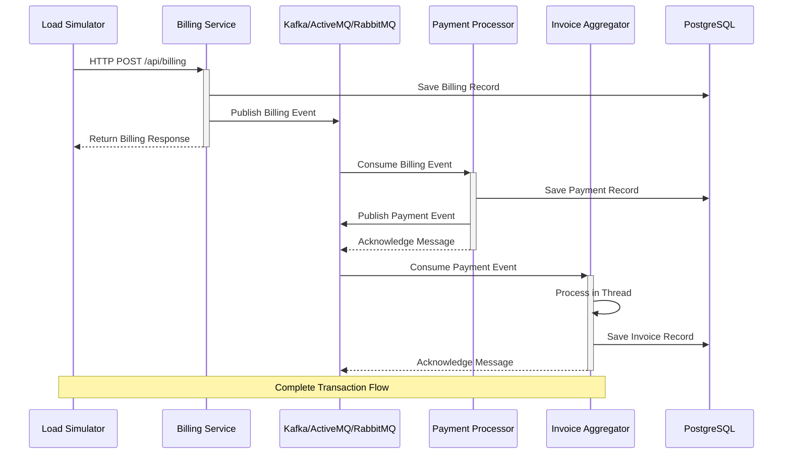

# Billing System Demo for Dynatrace Tracing Comparison

This project is a demo billing system designed to showcase the differences in tracing across different Kubernetes namespaces with different instrumentation and messaging systems. The goal is to help engineering teams understand how traces look in different environments and with different configurations.

## Architecture

The system consists of four microservices:

1. **Billing Service**: Receives HTTP requests from the load simulator, processes them, saves information to a PostgreSQL database, and sends messages to a messaging system (Kafka, ActiveMQ, or RabbitMQ).

2. **Payment Processor**: Receives messages from the billing service, processes payments, and sends new messages to the invoice aggregator.

3. **Invoice Aggregator**: Receives messages from the payment processor, processes them in separate threads, and updates the database.

4. **Load Simulator**: Generates load by sending HTTP requests to the billing service every 5-7 seconds.

### Architecture Diagram

### Architecture Diagram



### Message Flow Diagram



## Deployment Environments

The application is deployed in six different Kubernetes namespaces, each with a different configuration:

1. **otel-kafka**: Uses OpenTelemetry instrumentation with Kafka as the messaging system. Labeled with `dynatrace.com/enrich: "true"` for Dynatrace enrichment.

2. **otel-activemq**: Uses OpenTelemetry instrumentation with ActiveMQ as the messaging system. Labeled with `dynatrace.com/enrich: "true"` for Dynatrace enrichment.

3. **otel-rabbitmq**: Uses OpenTelemetry instrumentation with RabbitMQ as the messaging system. Labeled with `dynatrace.com/enrich: "true"` for Dynatrace enrichment.

4. **oneagent-kafka**: Uses Dynatrace OneAgent with Kafka as the messaging system. Labeled with `dynatrace.com/inject: "true"` for OneAgent injection.

5. **oneagent-activemq**: Uses Dynatrace OneAgent with ActiveMQ as the messaging system. Labeled with `dynatrace.com/inject: "true"` for OneAgent injection.

6. **oneagent-rabbitmq**: Uses Dynatrace OneAgent with RabbitMQ as the messaging system. Labeled with `dynatrace.com/inject: "true"` for OneAgent injection.

## Prerequisites

- Kubernetes cluster
- kubectl configured to access your cluster
- Docker and Docker Hub account (for building and pushing images)
- GitHub account (for GitHub Container Registry)
- Dynatrace tenant with API token

## Building the Application

The application can be built using Maven and Docker. A GitHub Actions workflow is provided to build and push the Docker images to GitHub Container Registry.

To build and push the images manually:

```bash
# Build the billing-service
cd src/billing-service
mvn clean package
docker build -t ghcr.io/mreider/billing-service:latest .
docker push ghcr.io/mreider/billing-service:latest

# Build the payment-processor
cd ../payment-processor
mvn clean package
docker build -t ghcr.io/mreider/payment-processor:latest .
docker push ghcr.io/mreider/payment-processor:latest

# Build the invoice-aggregator
cd ../invoice-aggregator
mvn clean package
docker build -t ghcr.io/mreider/invoice-aggregator:latest .
docker push ghcr.io/mreider/invoice-aggregator:latest

# Build the load-simulator
cd ../load-simulator
mvn clean package
docker build -t ghcr.io/mreider/load-simulator:latest .
docker push ghcr.io/mreider/load-simulator:latest
```

## Deploying the Application

Before deploying, you need to create a Dynatrace secret with your API token and endpoint:

```bash
# Create the dynatrace-secret.yaml file
cat <<EOF > k8s/dynatrace-secret.yaml
apiVersion: v1
kind: Secret
metadata:
  name: dynatrace-secret
type: Opaque
data:
  endpoint: <base64-encoded-endpoint>
  api-token: <base64-encoded-api-token>
EOF
```

To deploy the application, run the deploy.sh script:

```bash
./deploy.sh
```

This script will:
1. Create the namespaces
2. Apply the Dynatrace secret
3. Deploy PostgreSQL, Kafka, and ActiveMQ in each namespace
4. Deploy the services in each namespace

## Comparing Traces

To compare traces across different namespaces and messaging systems:

1. Deploy the system with the provided scripts.
2. Generate load using the load-simulator service in each namespace.
3. View the traces in Dynatrace.
4. Compare how traces appear with different instrumentation methods (OpenTelemetry vs. OneAgent) and different messaging systems (Kafka vs. ActiveMQ vs. RabbitMQ).

Key aspects to observe:
- End-to-end transaction visibility
- Messaging context propagation
- Error detection and visualization
- Performance metrics across different messaging systems

## Dashboard and Analysis Suggestions

Consider creating the following in Dynatrace for better insights:

1. **Comparison Dashboard**: Create a side-by-side dashboard showing the same metrics across all six deployment configurations to easily spot differences in latency, throughput, and error rates.

2. **Messaging System Performance Analysis**: Use DQL notebooks to compare message processing times betIen Kafka, ActiveMQ, and RabbitMQ:

### Trace Context Propagation with Multithreaded Processing

Traces Ire breaking betIen the payment processor and invoice aggregator services (a multi-threaded service that "de-queues" many messages at once). The issue was missing trace context propagation across thread boundaries.

The problem occurred because:
1. The invoice aggregator services received messages from messaging systems (Kafka/ActiveMQ/RabbitMQ)
2. Processing was done in separate threads via an ExecutorService
3. The tracing context was not properly passed to these worker threads

This caused traces to appear terminated at the payment processor, even though the invoice aggregator was successfully processing messages.

### Solution

After initial fixes, I still observed issues with spans for Kafka and RabbitMQ, and ActiveMQ had no spans of kind consumer (only database call client spans). A more comprehensive approach was needed:

1. **Context Propagator Configuration**

   I added these flags to the `entrypoint.sh` files for all services:
   ```bash
   # Explicitly configure propagators
   -Dotel.propagators=tracecontext,baggage
   ```

2. **Messaging System-Specific Configuration**

   I added these system-specific flags in each service's `entrypoint.sh`:

   For ActiveMQ services:
   ```bash
   -Dotel.instrumentation.activemq.message-propagation.enabled=true
   -Dotel.instrumentation.jms.experimental.producer-messaging-links.enabled=true
   ```

   For Kafka services:
   ```bash
   -Dotel.instrumentation.kafka.experimental.message-propagation.enabled=true
   -Dotel.instrumentation.kafka.experimental.messages.enabled=true
   ```

   For RabbitMQ services:
   ```bash
   -Dotel.instrumentation.rabbitmq.experimental.message-propagation.enabled=true
   -Dotel.instrumentation.rabbitmq.experimental.consumer-parent-span-enabled=true
   ```

Here's the content formatted in Markdown:

```markdown
### Thread Context Propagation with Multithreaded Processing

Traces were breaking between the payment processor and invoice aggregator services (a multi-threaded service that "de-queues" many messages at once). The issue was missing trace context propagation across thread boundaries.

The problem occurred because:
1. The invoice aggregator services received messages from messaging systems (Kafka/ActiveMQ/RabbitMQ)
2. Processing was done in separate threads via an ExecutorService
3. The tracing context was not properly passed to these worker threads in the OpenTelemetry implementations

This caused traces to appear terminated at the payment processor when using OpenTelemetry, even though the invoice aggregator was successfully processing messages.

### Solution

After initial fixes, I still observed issues with spans for Kafka and ActiveMQ with OpenTelemetry, while RabbitMQ was working correctly. A more comprehensive approach was needed:

1. **Context Propagator Configuration**

   I added these flags to the `entrypoint.sh` files for all OpenTelemetry services:
   ```bash
   # Explicitly configure propagators
   -Dotel.propagators=tracecontext,baggage
   ```

2. **Messaging System-Specific Configuration**

   I added these system-specific flags in each service's `entrypoint.sh`:

   For ActiveMQ services:
   ```bash
   -Dotel.instrumentation.activemq.message-propagation.enabled=true
   -Dotel.instrumentation.jms.experimental.producer-messaging-links.enabled=true
   ```

   For Kafka services:
   ```bash
   -Dotel.instrumentation.kafka.experimental.message-propagation.enabled=true
   -Dotel.instrumentation.kafka.experimental.messages.enabled=true
   ```

   For RabbitMQ services:
   ```bash
   -Dotel.instrumentation.rabbitmq.experimental.message-propagation.enabled=true
   -Dotel.instrumentation.rabbitmq.experimental.consumer-parent-span-enabled=true
   ```